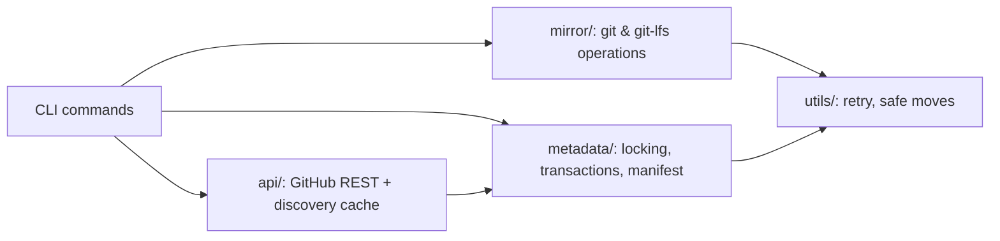

# gh-helix

**A production-grade Git repository mirror and disaster recovery tool for GitHub organizations.**

[](https://github.com/trivedi-vatsal/gh-helix/actions/workflows/ci.yml)
[](https://github.com/trivedi-vatsal/gh-helix/actions/workflows/codeql.yml)
[](LICENSE)
[](package.json)

gh-helix backs up every repository in a GitHub organization to verifiable, browsable local copies,
and restores an independent working copy back — including Git LFS content — entirely offline, with
no dependency on GitHub being reachable at the moment you actually need to recover something.

📖 **[Full documentation](docs/README.md)** · 🏗️ **[Architecture](docs/architecture.md)** ·
📐 **[Architecture Decision Records](docs/adr/)** · 🧪 **[Examples](examples/)**

---

## Table of contents

- [Why this project exists](#why-this-project-exists)
- [Features](#features)
- [Comparison with alternatives](#comparison-with-alternatives)
- [Architecture overview](#architecture-overview)
- [Installation](#installation)
- [Quick start](#quick-start)
- [Configuration](#configuration)
- [Authentication](#authentication)
- [CLI commands](#cli-commands)
- [Examples](#examples)
- [Screenshots](#screenshots)
- [Disaster recovery](#disaster-recovery)
- [Performance](#performance)
- [FAQ](#faq)
- [Contributing](#contributing)
- [Roadmap](#roadmap)
- [Extension points](#extension-points)
- [License](#license)

## Why this project exists

GitHub is reliable, but "reliable" and "the only copy" shouldn't be the same category of risk for
an organization's entire source history. Accidental repository deletion, an over-broad token
scope, a GitHub outage at exactly the wrong moment, or a mistaken `git push --force` upstream can
each turn "GitHub has it" into "nobody has it." gh-helix exists to make that scenario boring: a
scheduled, idempotent job that keeps verifiable, disaster-recoverable mirrors of every repository
in an org, and a restore path that works even when GitHub itself doesn't.

Every design decision in this codebase — real source files on disk instead of an opaque object
store, LFS treated as part of the backup rather than optional, crash-safe metadata and directory
operations, cross-process locking — is downstream of that one goal. See
[docs/architecture.md](docs/architecture.md#design-goals) for the full reasoning, and
[docs/adr/](docs/adr/) for the decision-by-decision detail.

## Features

- **Discovers repositories via the GitHub REST API** (`@octokit/rest`), with a persisted,
  time-boxed cache so it doesn't re-list thousands of repositories on every run.
- **Clones every branch as a normal, browsable working-tree copy** (`git clone --no-single-branch`,
  kept in sync with `fetch --all --prune` + checkout of the default branch) — the actual source
  files are on disk in the backup directory, not locked inside a bare object store. This trades
  some fidelity for that visibility: tags and standard branches all come through, but Git notes
  and PR refs (`refs/pull/*`) are not fetched the way a true `--mirror` clone would.
- **Detects new, renamed, and archived repositories automatically**, keyed by each repository's
  stable GitHub ID (so renames are never mistaken for deletions).
- **Never deletes a local repository copy.** Repositories removed from GitHub are moved into
  `_deleted/`, not erased.
- **Runs Git operations in parallel** with a configurable worker pool.
- **Validates every repository copy** (`origin` remote + `git fsck`) after every sync, and
  continues past individual failures instead of aborting the whole run.
- **Writes a full manifest** (`.metadata/manifest.json`) after every run — per-repository size,
  default branch, last commit SHA, LFS status, and outcome.
- **Treats a failed `git lfs fetch` as a real backup failure**, not a warning — a copy missing its
  LFS objects isn't disaster-recoverable, so it isn't reported as a success.
- **Restores an independent working clone straight from the local backup, entirely offline**,
  rehydrating Git LFS objects as part of that restore — or fails loudly rather than handing back
  pointer files silently.
- **Degrades gracefully when GitHub is unreachable**, falling back to the last cached discovery
  instead of aborting, so a GitHub outage doesn't stop Git-level maintenance of repositories you
  already know about.
- **Metadata is written atomically and transactionally**, never silently discarded on corruption —
  a bad file is quarantined alongside a loud warning instead of being treated as empty.
- **Cross-process locking** on `backup`, `restore`, `clean`, and `verify` so two invocations can
  never mutate (or read mid-mutation) the same repositories at once.
- **Every directory move is transactional** — staged, verified, then committed. A repository copy
  is never deleted until a verified replacement exists in its final location.
- **Safe to interrupt anywhere.** Killing the process mid-operation and re-running the same
  command resolves the interruption automatically — no manual repair.

See [docs/architecture.md](docs/architecture.md) for how these fit together, and
[docs/adr/](docs/adr/) for why each one was built this way instead of the obvious alternative.

## Comparison with alternatives

| | gh-helix | Plain `git clone` scripts | [ghorg](https://github.com/gabrie30/ghorg) | GitHub's export/migration API |
| --- | --- | --- | --- | --- |
| Browsable source files on disk | ✅ | Depends on script | ❌ (bare mirrors) | N/A (full org export, not Git-native) |
| Rename/orphan detection | ✅ (ID-keyed) | ❌ | Partial | N/A |
| LFS treated as a hard failure, not a warning | ✅ | ❌ | ❌ | N/A |
| Offline restore with LFS pointer verification | ✅ | ❌ | ❌ | ❌ |
| Crash-safe, resumable operations | ✅ | ❌ | ❌ | N/A |
| Cross-process locking | ✅ | ❌ | ❌ | N/A |
| Degraded mode on GitHub outage | ✅ | ❌ | ❌ | N/A |
| GitHub Enterprise Server support | ✅ | Depends | ✅ | ✅ |
| Scope | Git data (backup/restore) | Git data | Git data (clone-focused) | Full org (issues, PRs, wiki, settings) |

gh-helix is narrower in scope than a full org-migration tool by design — see
[Non-goals](docs/roadmap.md#non-goals) — and deliberately more conservative than a simple clone
script about what counts as "successfully backed up." It was originally inspired by
[ghorg](https://github.com/gabrie30/ghorg); the primary differences are the disaster-recovery
guarantees above (crash-safety, verified LFS restore, locking, transactional metadata) rather than
raw cloning speed or feature breadth.

## Architecture overview



`commands/` orchestrates; `api/` talks to GitHub; `mirror/` talks to Git; `metadata/` owns
`.metadata/*.json` and the cross-process lock; `utils/` holds cross-cutting primitives. This
strict layering is what makes the [extension points](#extension-points) below additive rather
than requiring disruptive refactors. Full diagrams (component, sequence, backup/restore lifecycle,
lock acquisition, metadata transaction flow): **[docs/architecture.md](docs/architecture.md)**.

## Installation

```bash
git clone https://github.com/trivedi-vatsal/gh-helix.git
cd gh-helix
npm install
npm run build
```

Run without installing globally:

```bash
node dist/cli.js --help
```

Or link it as a global command:

```bash
npm link
gh-helix --help
```

Requires Node.js 22+, Git on `PATH`, and Git LFS on `PATH` if `FETCH_LFS=true` (the default).
Full prerequisites and platform notes: **[docs/installation.md](docs/installation.md)**.

## Quick start

```bash
cp .env.example .env        # fill in GITHUB_ORG, BACKUP_DIRECTORY, GITHUB_TOKEN

gh-helix health              # confirm the environment is ready
gh-helix backup --dry-run     # preview what would happen
gh-helix backup                # run it for real
gh-helix status                 # check the result
gh-helix verify                  # git fsck every mirror
gh-helix restore my-repo ./out    # prove a restore works, offline
```

If you just changed token/org permissions and `list` or `backup --dry-run` still looks stale,
force a live discovery call:

```bash
gh-helix list --refresh
gh-helix backup --dry-run --refresh
```

Full walkthrough: **[docs/getting-started.md](docs/getting-started.md)**.

## Configuration

Configuration can come from **`.env`**, **`config.json`**, or the real process environment. When
a setting is defined in more than one place, the process environment (which includes anything
loaded from `.env`) always wins over `config.json`.

| Variable | Required | Default | Description |
| --- | --- | --- | --- |
| `GITHUB_ORG` | yes | — | GitHub organization login to back up. |
| `BACKUP_DIRECTORY` | yes | — | Absolute path where mirrors are stored. |
| `MAX_PARALLEL` | no | `5` | Worker pool size for concurrent Git operations. |
| `FETCH_LFS` | no | `true` | Run `git lfs fetch --all` after every clone/update. |
| `GITHUB_TOKEN` | no* | — | GitHub token. See [Authentication](#authentication). |
| `GH_TOKEN` | no* | — | Fallback token if `GITHUB_TOKEN` is unset. |
| `GH_HOST` | no | — | Enterprise hostname, used only for the `gh auth token` fallback. |
| `GITHUB_API_URL` | no | `https://api.github.com` | REST API base URL for GitHub Enterprise Server. |

\* At least one token source is required: `GITHUB_TOKEN`, `GH_TOKEN`, or a working `gh auth
login` session.

Every option, precedence rules, and validation behavior: **[docs/configuration.md](docs/configuration.md)**.

## Authentication

Token resolution order: `GITHUB_TOKEN` → `GH_TOKEN` → `gh auth token` (fallback, requires `gh
auth login` first). The same token is used for both the REST API and Git operations — injected as
an ephemeral `Authorization` header per Git subprocess, never persisted into `.git/config` or
visible in argv. No token available → falls back to SSH, requiring your own SSH key.

Full detail, including GitHub Enterprise Server: **[docs/authentication.md](docs/authentication.md)**.

## CLI commands

| Command | Purpose | Needs GitHub API | Acquires lock |
| --- | --- | --- | --- |
| `backup` | Discover repos, sync mirrors | ✅ | ✅ |
| `status` | Counts, disk usage, last sync | ✅ | ❌ |
| `verify` | `git fsck` every local mirror | ❌ | ✅ |
| `list` | Per-repo local status | ✅ | ❌ |
| `clean` | Move orphans into `_deleted/` | ✅ | ✅ |
| `restore <repo>` | Restore a working copy, offline | ❌ | ✅ |
| `health` | Environment/connectivity checks | conditionally | ❌ |

```bash
gh-helix backup --dry-run --include "api-*" --exclude "*-archive" --report backup-report.json
gh-helix restore my-repo --destination D:\Restore\my-repo
gh-helix clean --dry-run
gh-helix backup --force-lock
```

Every flag, every exit code: **[docs/cli-reference.md](docs/cli-reference.md)**.

### Exit codes

| Code | Meaning |
| --- | --- |
| `0` | Success, no failures |
| `1` | Completed, but partial failure (repo failure, degraded discovery, LFS restore issue) |
| `2` | GitHub authentication or org access failed |
| `3` | Invalid or missing configuration |
| `4` | Lock conflict or other fatal error |

## Examples

Runnable scenarios with commands, config, and expected output live under
**[examples/](examples/)**:

[basic-backup](examples/basic-backup/) · [scheduled-backup](examples/scheduled-backup/) ·
[github-enterprise](examples/github-enterprise/) · [offline-backup](examples/offline-backup/) ·
[offline-restore](examples/offline-restore/) ·
[restore-single-repository](examples/restore-single-repository/) ·
[restore-entire-organization](examples/restore-entire-organization/) ·
[docker](examples/docker/) · [windows](examples/windows/) · [linux](examples/linux/) ·
[macos](examples/macos/)

## Screenshots

> _Terminal output screenshots are welcome via PR — see [CONTRIBUTING.md](CONTRIBUTING.md)._

```
$ gh-helix backup
✓ Cloned api-service
✓ Updated web-frontend
⚠ Archived repo skipped: legacy-tool
== Backup Summary ==
Total repositories: 3
Cloned: 1
Updated: 1
Archived: 1
Failed: 0
```

```
$ gh-helix health
✓ Git: git version 2.45.0
✓ Git LFS: git-lfs/3.5.1
✓ Backup directory: D:/GitHubBackups
✓ Authentication: token resolved (GITHUB_TOKEN)
✓ API connectivity: Connected (rate limit: 4998/5000)
== Health Summary ==
Checks passed: 7/7
```

## Disaster recovery

gh-helix's mirrors are the disaster-recovery copy. `restore` reconstructs a working clone —
including Git LFS content — from a local mirror alone, with **zero GitHub access**. Runbooks for
losing a single repository, an entire org, or the backup host itself:
**[docs/disaster-recovery.md](docs/disaster-recovery.md)**.

## Performance

Discovery is paginated and cached; `status`'s disk-usage figure comes from GitHub's own reported
repository size rather than a filesystem walk, so it stays fast well beyond 10,000 repositories.
`MAX_PARALLEL` is the primary tuning knob. Benchmark methodology and how to contribute real
numbers: **[docs/performance.md](docs/performance.md)**.

## FAQ

Short answers to common questions (does it delete anything? is it safe to interrupt? does it
support GitLab? why does disk usage look approximate?):
**[docs/faq.md](docs/faq.md)**.

## Contributing

Contributions are welcome — see **[CONTRIBUTING.md](CONTRIBUTING.md)** for setup, workflow, and
engineering norms, and **[docs/testing.md](docs/testing.md)** for the test architecture.

```bash
npm run dev -- backup --dry-run   # run with tsx, no build step
npm run typecheck                 # tsc --noEmit
npm run lint                      # eslint
npm run format                    # prettier --write
npm test                          # vitest run
npm run build                     # compile to dist/
```

This project follows the [Contributor Covenant](CODE_OF_CONDUCT.md). See
[GOVERNANCE.md](GOVERNANCE.md) for how decisions get made, and
[SECURITY.md](SECURITY.md) for reporting a vulnerability.

## Roadmap

The core loop (discover → mirror → verify → record) is deliberately small and stable; most future
work is additive around documented extension points below. See **[ROADMAP.md](ROADMAP.md)** and
**[docs/roadmap.md](docs/roadmap.md)** for known gaps and what's under consideration.

## Project structure

```
src/
    cli.ts               Commander entrypoint
    commands/            One file per CLI subcommand (orchestration layer)
    api/                  GitHub REST API client and repository discovery
    mirror/                Git mirror operations (clone, update, verify, LFS, restore, rename, orphans, auth)
    metadata/               Persisted state: locking, transactions, cache, manifest
    config/                 .env / config.json loading & validation
    logger/                 Colored console + log-file output
    utils/                  exec, fs, retry, filter, time, paths, safe moves
tests/                    Vitest unit + integration tests (mirrors src/ layout)
docs/                     Full documentation site (see docs/README.md)
docs/adr/                  Architecture Decision Records
examples/                  Runnable example scenarios
```

Full breakdown: [docs/architecture.md](docs/architecture.md#component-overview).

## Extension points

The layered architecture (`api/` / `mirror/` / `metadata/` / `commands/`) is designed so the
following can be added later with minimal changes to existing code:

- **Storage backends** (Azure Blob Storage, Amazon S3): `mirror/` operations write to local
  paths; a backend interface can wrap `mirror/clone.ts` and `mirror/update.ts` to also push
  mirrors to object storage without touching discovery or manifest logic.
- **Docker image / GitHub Actions**: the CLI has no interactive prompts and already returns
  distinct exit codes per failure class, so it's container- and CI-ready as-is (see
  [examples/docker](examples/docker/)).
- **Scheduled daemon mode**: `commands/backup.ts` is a single async function; a daemon wrapper
  can call it on an interval instead of the CLI invoking it once per process.
- **Incremental snapshots**: `metadata/manifest.ts` already records a full manifest per run;
  diffing consecutive manifests is enough to derive an incremental snapshot.
- **Web dashboard / Prometheus metrics**: both can be built by reading
  `.metadata/manifest.json` and `.metadata/last-run.json`, which are stable, versioned JSON files
  rather than being coupled to CLI output.
- **SQLite/Postgres metadata store**: `metadata/cache.ts` and `metadata/manifest.ts` are the only
  modules that touch the JSON files on disk; swapping their read/write functions for a database
  client is a localized change.

These are intentionally **not implemented** yet — only the seams for them exist. See
[docs/roadmap.md](docs/roadmap.md).

## License

[MIT](LICENSE)

---

Inspired by [ghorg](https://github.com/gabrie30/ghorg).
