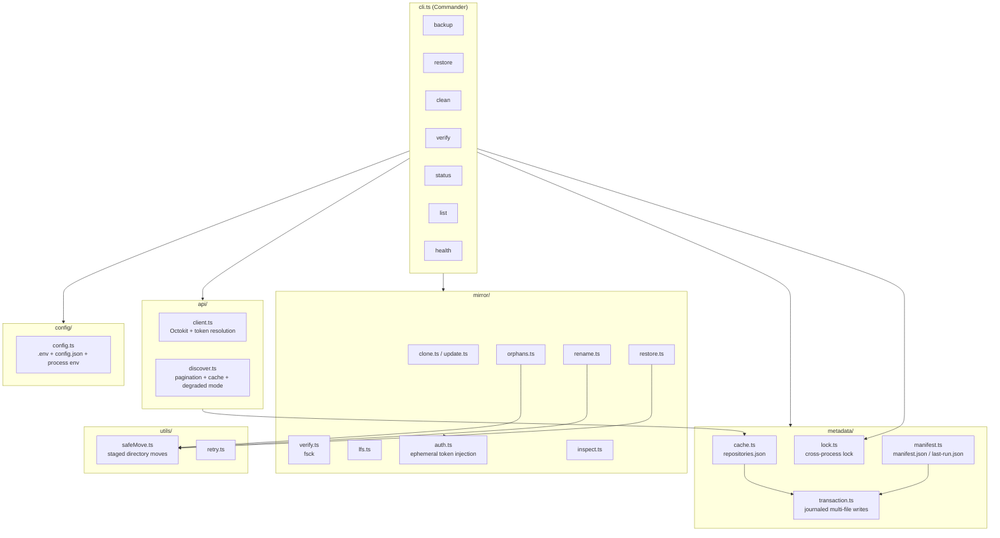
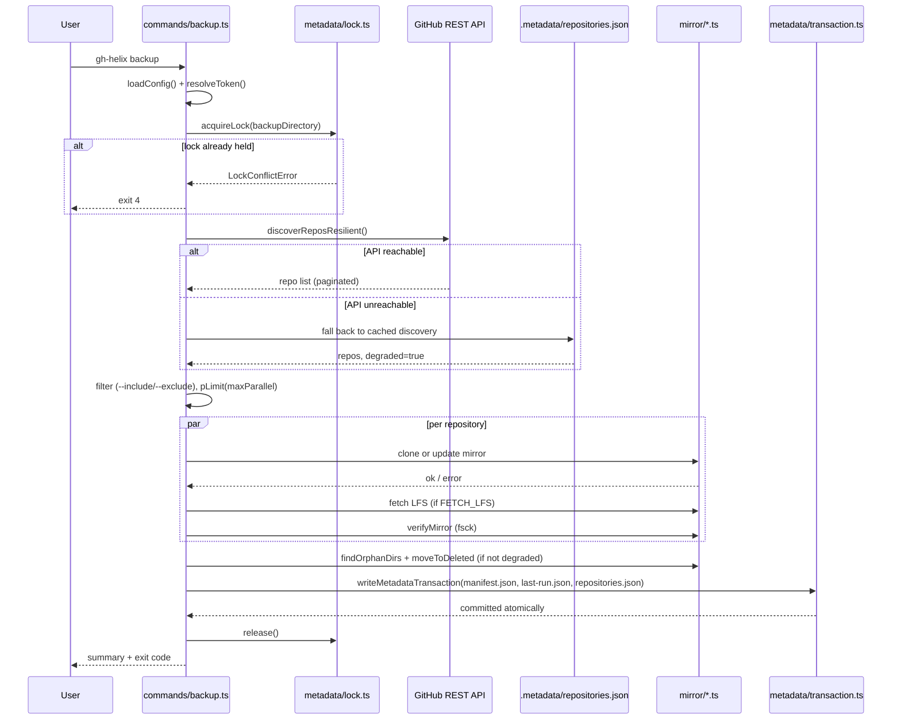
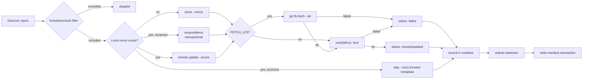
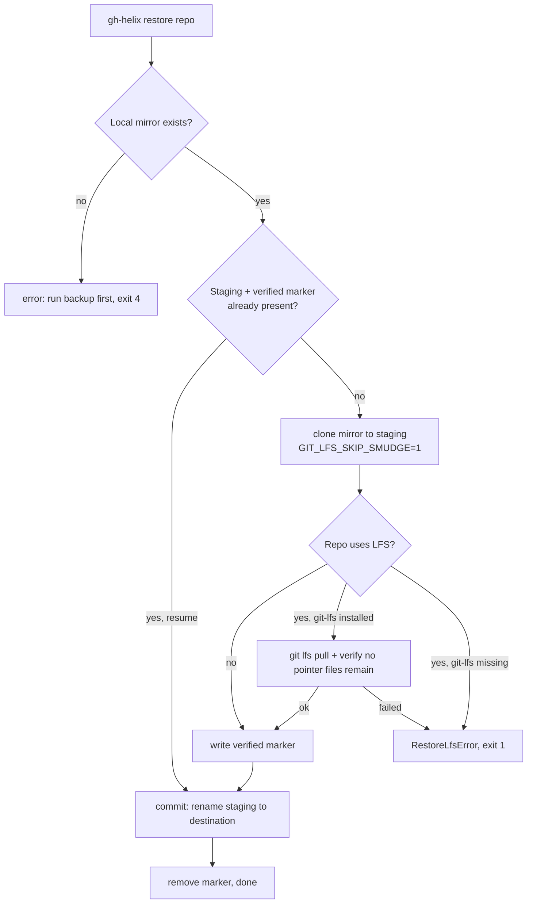
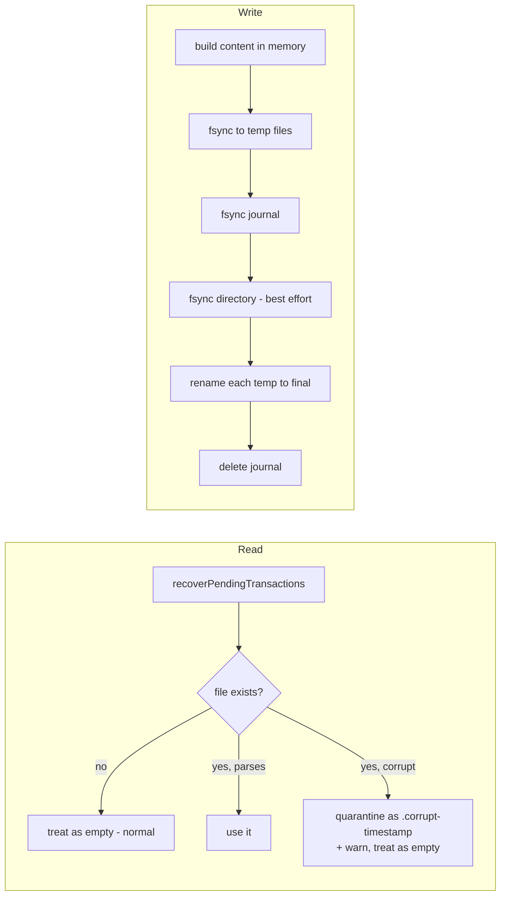
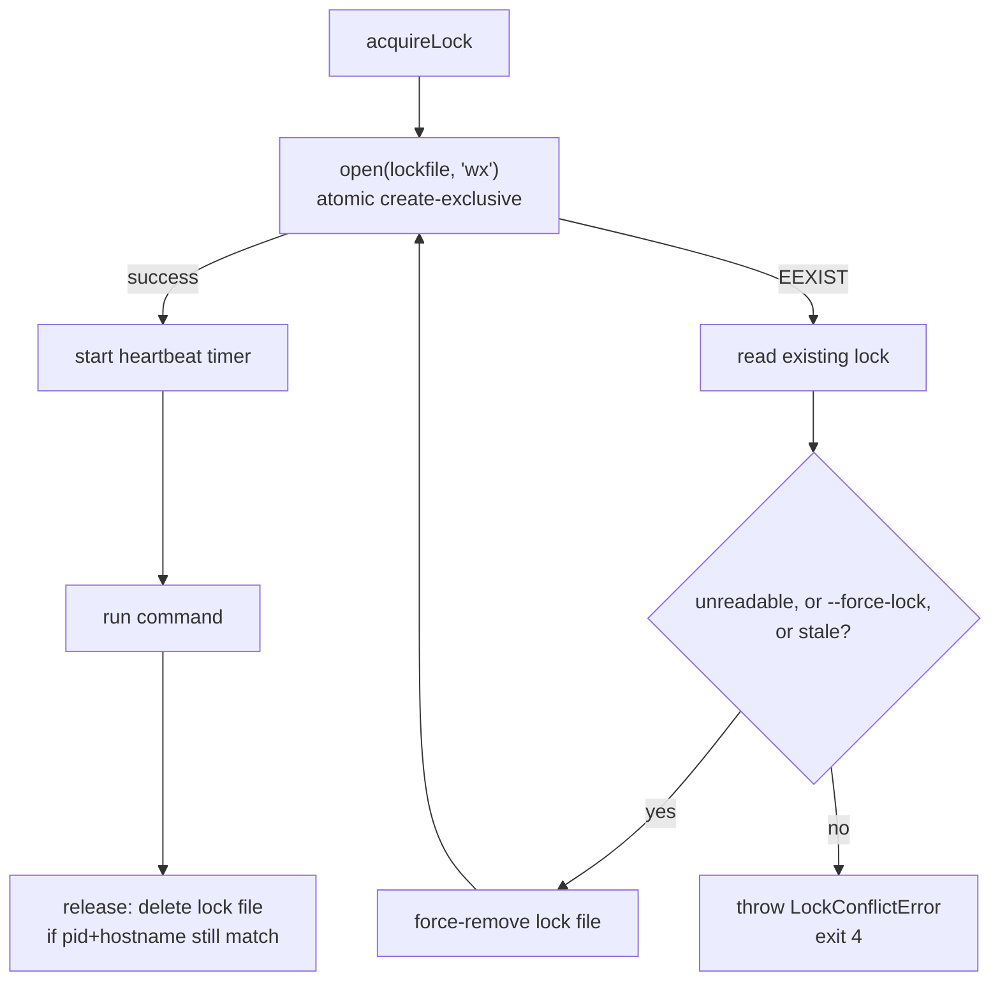
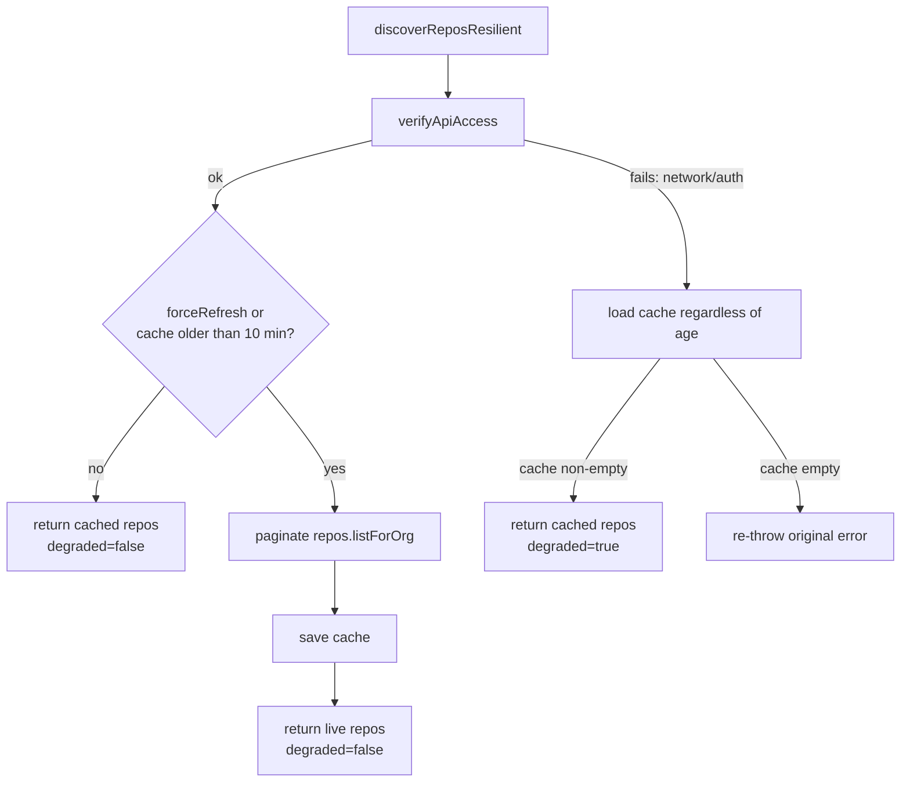
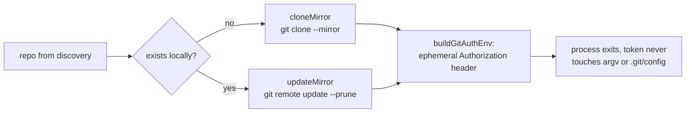

# Architecture

## Design goals

gh-helix exists to answer one question with confidence: *if GitHub disappeared right now, could
we get every repository back?* Every architectural choice in this codebase is downstream of that
goal:

1. **Mirrors, not clones.** A working clone loses refs, notes, and remote-tracking branches that
   don't map to a local branch. A `git clone --mirror` keeps everything.
2. **Verifiable, not just "ran without error."** Every mirror is `git fsck`'d after every sync.
   LFS is treated as part of the repository, not an optional extra — a mirror missing its LFS
   objects is not disaster-recoverable, so it's reported as a failure, not a warning.
3. **Safe to interrupt, anywhere.** Every operation that touches disk (metadata writes, directory
   moves, restores) is designed so that killing the process mid-operation and re-running the same
   command resolves the interruption automatically. See [Transaction Model](transaction-model.md)
   and the safe-move algorithm below.
4. **Safe to run concurrently with itself.** Two invocations against the same backup directory
   must never race. See [Locking](locking.md).
5. **Scale-aware.** Discovery is paginated and cached; disk usage is read from GitHub's own
   repository metadata rather than walking the filesystem, so `status` stays fast at 10,000+ repos.
6. **Degrade, don't fail closed.** If the GitHub API is unreachable, Git-level maintenance of
   mirrors you already know about should still be possible — see
   [Repository Discovery](repository-discovery.md#degraded-mode).

## Component overview

### Component responsibilities

| Layer | Responsibility | Knows about |
| --- | --- | --- |
| `cli.ts` / `commands/` | Parse arguments, orchestrate a single command end-to-end, own the exit code | Everything below it |
| `api/` | Talk to the GitHub REST API, resolve tokens, cache and degrade discovery | Octokit, `.metadata/repositories.json` |
| `mirror/` | All `git`/`git lfs` process invocations against a single mirror | Local filesystem, `git`, `git-lfs` |
| `metadata/` | Read/write `.metadata/*.json` durably and atomically, hold the cross-process lock | Filesystem only — no Git, no GitHub |
| `utils/` | Cross-cutting primitives (retry, safe moves, exec, filtering) | Nothing above it |

This is a strict layering: `mirror/` never reaches into `metadata/`, and `metadata/` never shells
out to `git`. `commands/` is the only layer that composes across all of them. This is what makes
the [extension points](../README.md#extension-points) in the root README possible without
touching existing code — a storage backend or a web dashboard reads `metadata/manifest.ts`'s
output; it doesn't need to understand `mirror/`'s internals at all.

## Data flow: a single `backup` run

The three metadata files are written as **one transaction** deliberately — see
[Transaction Model](transaction-model.md) for why partial writes here would be worse than no
write at all.

## Backup lifecycle

Full narrative: [Backup Workflow](backup-workflow.md).

## Restore lifecycle

`restore` is the one command that never talks to GitHub — it reconstructs a working copy purely
from a local mirror, which is the entire point of a disaster-recovery tool: it must work when
GitHub itself is the thing that's down.

Full narrative: [Restore Workflow](restore-workflow.md).

## Metadata lifecycle

Every read path (`loadCache`, `loadManifest`, `loadLastRun`) calls `recoverPendingTransactions`
first, so a journal left behind by a crashed previous process is replayed (or discarded, if
corrupt) before anything else happens — see [Transaction Model](transaction-model.md).

## Lock acquisition flow

Staleness rule: a same-host lock is stale iff its PID is no longer running
(`process.kill(pid, 0)` → `ESRCH`); a lock written by a *different* host is stale once it's older
than 15 minutes, since PID liveness can't be checked across hosts. Full detail:
[Locking](locking.md).

## Repository discovery flow

Full detail, including why orphan detection and `clean` behave differently under degraded mode:
[Repository Discovery](repository-discovery.md).

## Mirror synchronization flow (single repository)

Token injection uses Git's `GIT_CONFIG_COUNT` / `GIT_CONFIG_KEY_n` / `GIT_CONFIG_VALUE_n`
environment-variable config-override mechanism to set `http.extraheader` to
`AUTHORIZATION: bearer <token>` for the lifetime of a single subprocess only — see
[Authentication](authentication.md#how-the-token-reaches-git).

## Failure recovery

Every stateful operation in gh-helix follows the same pattern: **stage, verify, commit** — never
"mutate in place" and never "delete before the replacement is confirmed."

| Operation | Staging area | Verification | Commit |
| --- | --- | --- | --- |
| Metadata write | `.tx-<uuid>.json` journal + per-file `.tmp-<id>` | journal itself is fsynced before any rename | rename each temp file into place, then delete journal |
| Orphan move / rename | `<dest>.staging` | `git fsck` (or structural compare) on the staged copy | rename staged copy to final destination |
| Restore | `<destination>.restoring` + `.verified` marker | LFS pointer scan on staged clone | rename staging to destination |
| Lock acquisition | N/A | PID liveness / hostname+age | atomic `open(..., 'wx')` |

Because every commit step is a single `rename()` (atomic within a directory on POSIX and
Windows), a process killed at any point before that rename leaves the *original* untouched, and a
process killed after it leaves the *result* complete. Re-running the same command is always
sufficient to finish or discard whatever was interrupted — there is deliberately no separate
`repair` or `fsck`-style command, because the normal command already does that job.

## See also

- [Locking](locking.md)
- [Transaction Model](transaction-model.md)
- [Metadata](metadata.md)
- [Repository Discovery](repository-discovery.md)
- [Backup Workflow](backup-workflow.md)
- [Restore Workflow](restore-workflow.md)
- [ADRs](adr/) for the reasoning behind each of these choices
