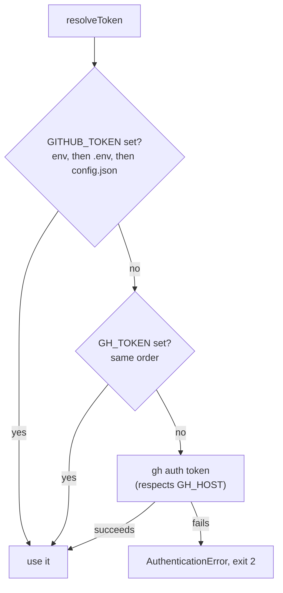

# Authentication

## Token resolution order

`resolveToken` checks these sources, in order, and uses the first one found:

1. **`GITHUB_TOKEN`** — real environment variable, then `.env`, then `config.json`
2. **`GH_TOKEN`** — same three-way check, used as a fallback if `GITHUB_TOKEN` is unset
3. **`gh auth token`** — only attempted if *neither* of the above is set anywhere; requires
   `gh auth login` to have been run beforehand (respects `GH_HOST` for Enterprise)

If none of the three resolves a token, gh-helix throws `AuthenticationError` and exits with code
`2`. The one exception is `gh-helix restore`, which never calls `resolveToken` at all — restoring
from a local mirror requires no GitHub access whatsoever.



## Creating a token

A [fine-grained personal access token](https://github.com/settings/personal-access-tokens/new)
scoped to the organization, or a classic PAT with the `repo` scope, both work. The token needs at
least **read access to the organization's repositories** — gh-helix never writes to GitHub (it
only reads repository metadata and clones/fetches).

For GitHub Enterprise Server, generate the token from your GHES instance, not github.com.

## Where the token is used

The **same token** is used for both:

1. The GitHub REST API (via `@octokit/rest`) — listing repositories, checking org access, rate
   limits.
2. Git operations — cloning and fetching mirrors over HTTPS.

## How the token reaches Git

Mirrors are cloned/fetched over HTTPS with the token injected as an **ephemeral** `Authorization`
header, using Git's `GIT_CONFIG_COUNT` / `GIT_CONFIG_KEY_n` / `GIT_CONFIG_VALUE_n` environment
variable mechanism:

```
GIT_CONFIG_COUNT=1
GIT_CONFIG_KEY_0=http.extraheader
GIT_CONFIG_VALUE_0=AUTHORIZATION: bearer <token>
```

This is set only in the environment of the specific `git`/`git lfs` subprocess being spawned. As
a result:

- The token **never appears in `argv`** — it isn't visible to `ps`, Task Manager, or shell
  history, unlike a token embedded in a clone URL (`https://<token>@github.com/...`).
  The token also never appears in `.git/config` inside a repository — it isn't visible if you
  later share, back up, or inspect that config file.
- The token **is never persisted** into the mirror's `.git/config` — inspecting a mirror's config
  after a backup run reveals no credential.
- Every subprocess gets a fresh copy of this env var; nothing is cached or reused across
  processes.

If no token is available at all (e.g. no `GITHUB_TOKEN`/`GH_TOKEN` and `gh auth token` wasn't
attempted or isn't relevant, as in `restore`), Git operations fall back to the repository's SSH
URL (`git@github.com:org/repo.git`), which requires your own SSH key to already be configured
with GitHub.

## Scopes and permissions

| Operation | Requires |
| --- | --- |
| `discoverRepos` (list org repos) | Read access to the organization, via the REST API |
| `verifyApiAccess` (org lookup, used by `discoverReposResilient`) | Read access to the organization |
| Clone/fetch (HTTPS) | Read access to each repository |
| Clone/fetch (SSH, no token) | An SSH key registered with GitHub with read access |
| `health`'s API connectivity check | Any valid token (calls `rateLimit.get()`) |

gh-helix does not request write scopes and does not perform any write operations against
GitHub — it only reads.

## GitHub Enterprise Server

See [GitHub Enterprise Server](github-enterprise.md) for `GH_HOST` and `GITHUB_API_URL`. The
token resolution order is identical; `GH_HOST` only affects the `gh auth token` fallback (step 3
above), telling the `gh` CLI which host to ask.

## Secrets handling

- Prefer `.env` (already in `.gitignore`) or real environment variables over `config.json` for
  `GITHUB_TOKEN`/`GH_TOKEN` — see [Configuration](configuration.md#secrets).
- In CI, use your platform's secret store (GitHub Actions secrets, etc.) and inject as an
  environment variable — never check a token into a workflow file or `config.json`.
- See [Security](security.md) for the full threat model and how to report a credential leak.

## Troubleshooting

See [Troubleshooting: Authentication](troubleshooting.md#authentication-errors-exit-code-2).
