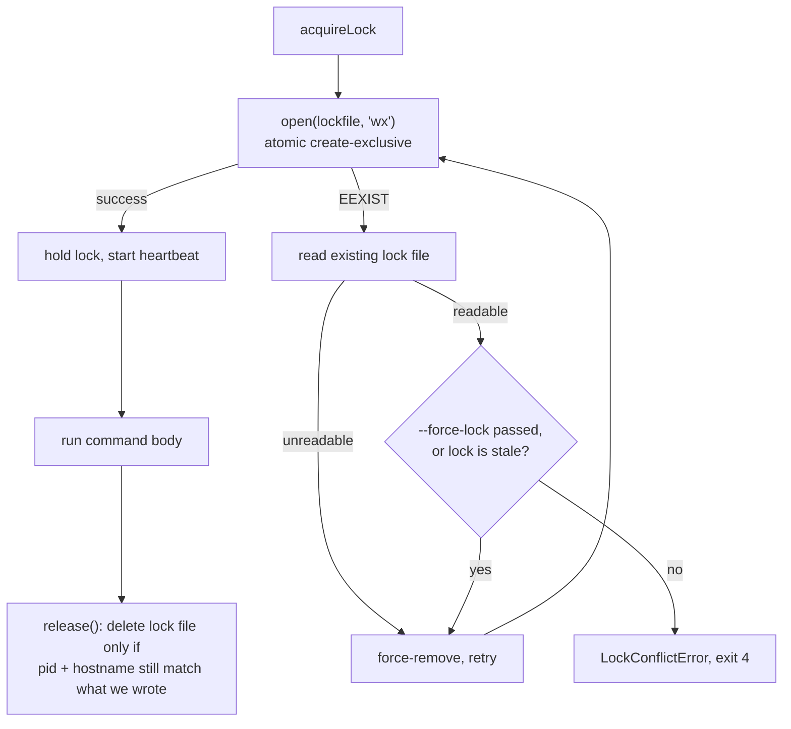

# Locking

`backup`, `restore`, `clean`, and `verify` each acquire an **exclusive cross-process lock** over
the backup directory before touching any mirror, and fail immediately — rather than hanging — if
another instance already holds it. `status`, `list`, and `health` don't lock: they're read-only
and safe to run alongside anything else.

## Why a lock exists at all

Two invocations against the same `BACKUP_DIRECTORY` must never race — a `backup` cloning into a
directory that `clean` is simultaneously moving into `_deleted/`, or two `backup` runs both
writing `.metadata/manifest.json`, would produce silently corrupted or inconsistent state. The
lock makes that structurally impossible rather than relying on operators to avoid overlapping
schedules.

## Mechanics

Lock file: `<BACKUP_DIRECTORY>/.metadata/backup.lock`, JSON:

```json
{ "pid": 12345, "hostname": "backup-host-01", "timestamp": "2026-07-03T12:00:00.000Z", "command": "backup" }
```



**Acquisition** uses `open(file, 'wx')` — atomic create-exclusive at the filesystem level, which
is what makes acquisition race-free between two processes starting at nearly the same instant:
only one `open` call can succeed when the file doesn't yet exist.

**Conflict**: if the file already exists (`EEXIST`), the existing lock is read and inspected:

- Unreadable (corrupt) → treated as safe to remove, retried.
- `--force-lock` passed → force-removed unconditionally, retried.
- **Stale** (see below) → force-removed, retried.
- Otherwise (live lock, not forced) → `LockConflictError`, exit code `4`, with a message showing
  the holder's pid/hostname/command/timestamp and a hint to retry with `--force-lock`.

This retry loop runs up to 3 total attempts before giving up with a generic error (guards against
a pathological race where the lock is repeatedly recreated by another process faster than this
one can retry).

## Staleness rules

A lock is reclaimed automatically once it's **provably** stale:

| Lock's hostname | Staleness test |
| --- | --- |
| Same host as the current process | The owning PID is no longer running (`process.kill(pid, 0)` throwing `ESRCH`). Any other error from that check (e.g. `EPERM`) is treated conservatively as "still alive" — a permission error doesn't prove the process is gone. |
| A different host | Older than 15 minutes (`DEFAULT_STALE_TTL_MS`). PID liveness can't be checked across hosts, so age is the only signal available. |

If a lock is live by both tests but you're certain the previous process is actually gone (for
example, a hard reboot of a *different* machine that shares this backup directory over a network
share, inside the 15-minute window), pass `--force-lock` to break it unconditionally:

```bash
gh-helix backup --force-lock
```

Use `--force-lock` deliberately — breaking a lock that's actually still held by a running process
lets two processes mutate the same mirrors concurrently, which is exactly what the lock exists to
prevent.

## Heartbeat

Once held, the lock file's `timestamp` is refreshed every 30 seconds (`HEARTBEAT_INTERVAL_MS`)
via an unref'd `setInterval` (so it never keeps the process alive on its own). Each refresh is a
full atomic rewrite (temp file + rename), never an in-place edit, so a concurrent reader can never
observe a torn/partial lock file. This is what keeps a long-running `backup` against a large org
from ever looking stale to a different host mid-run.

## Release

`release()` re-reads the lock file and deletes it **only if it still matches** the `{pid,
hostname}` this process originally wrote. This guards against a specific race: if this lock was
force-broken and re-acquired by a different process while this one was still finishing up (which
shouldn't normally happen, but the check costs nothing), release won't delete the *other*
process's lock out from under it.

`withLock(backupDirectory, command, options, fn)` is the actual entry point used by every
command: acquire, run `fn`, always release in a `finally` block — even if `fn` throws.

## Design note: fail fast, never block

gh-helix is a CLI, not a daemon. It never blocks waiting for a lock to free — every conflict is
reported immediately as `LockConflictError`. This is intentional: a scheduled job (cron, Task
Scheduler, CI) that silently blocked instead of failing could stack up indefinitely and mask a
genuinely stuck previous run. Failing fast surfaces the conflict where a scheduler's own
retry/alerting logic can see it.

## See also

- [Architecture: Lock acquisition flow](architecture.md#lock-acquisition-flow)
- [Transaction Model](transaction-model.md)
- [ADR-0004: Cross-process locking](adr/0004-cross-process-locking.md)
- [Troubleshooting: Lock conflicts](troubleshooting.md#lock-conflicts-exit-code-4)
