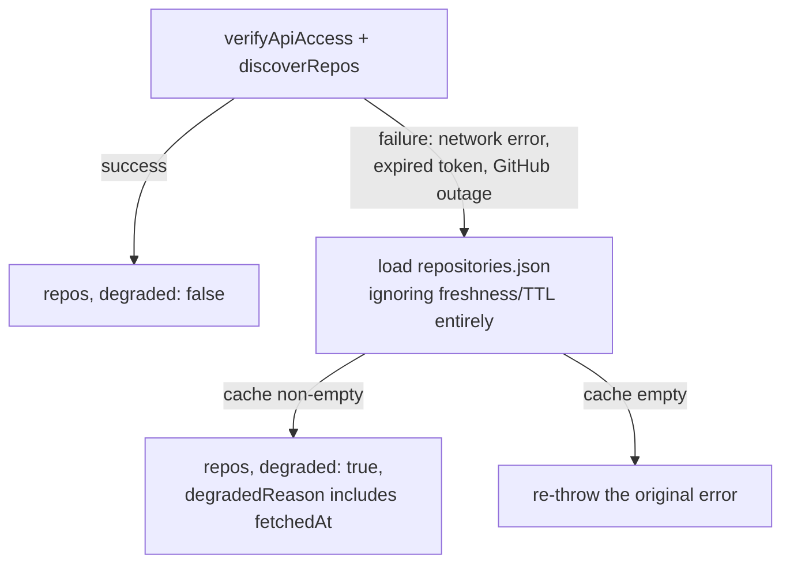

# Repository Discovery

How gh-helix finds out which repositories exist in an organization — and what happens when it
can't ask GitHub.

## Live discovery

`listOrgRepos(client, org)` paginates `GET /orgs/{org}/repos` (`type: 'all'`, `per_page: 100`) via
Octokit's async paginating iterator. Pages are never all materialized in memory at once — this
matters for organizations with 10,000+ repositories, where holding every page in memory
simultaneously before processing any of them would be wasteful and slow to first result.

Each raw API item is normalized into a `RemoteRepo`:

| Field | Notes |
| --- | --- |
| `id` | **Stringified.** This is the stable join key used for rename detection across runs — see [Metadata](metadata.md#repositoriesjson). |
| `name`, `nameWithOwner` | `nameWithOwner` falls back to `name` if `full_name` is absent. |
| `sshUrl`, `cloneUrl`, `htmlUrl` | Empty string / `html_url` if absent. |
| `isArchived`, `isFork`, `isDisabled` | Booleans, straight from the API. |
| `defaultBranch` | Defaults to `main` if unset. |
| `sizeKb` | Defaults to `0`. GitHub's own reported size — this is what `status`'s disk usage figure is built from, not a filesystem walk. |

`type: 'all'` means public, private, and forked repositories are all included.

## Caching

`discoverRepos` wraps live discovery with a 10-minute cache (`DEFAULT_CACHE_TTL_MS`), persisted
to `.metadata/repositories.json`:

- If a cache exists and `fetchedAt` is within 10 minutes (and `--refresh` wasn't passed), the
  cached list is returned without any API call.
- Otherwise, a live call is made and (unless the caller explicitly opts out, as `backup` does —
  see below) the result is saved back to the cache immediately.

This is a **deliberate correctness/scale tradeoff**: it means a repository created, renamed, or
deleted on GitHub in the last few minutes may not be reflected in a `backup`, `status`, `list`,
or `clean` run that happens to fall inside that window. Pass `--refresh` on any of them when you
need a guaranteed-current view — most commonly, right after creating a new repository you want
backed up immediately.

Without this cache, an org with several thousand repositories would re-list the entire org on
every single command invocation, which is both slow and burns API rate limit for no benefit on
back-to-back runs (e.g. a `status` check moments after a `backup`).

### Why `backup` doesn't persist the cache itself

`discoverReposResilient` is called from `backup.ts` with `persistCache: false`. A `backup` run
still needs the discovery result immediately (to know what to clone/update), but the cache
**write** is deferred and bundled into the single end-of-run metadata transaction alongside
`manifest.json` and `last-run.json` — so a crash between "cache updated" and "manifest written"
can never happen; either all three files advance together, or none of them do. See
[Transaction Model](transaction-model.md).

`status`, `list`, and `clean` call discovery with default options (`persistCache` unset, so
`true`) — they don't have a competing transaction to join, so they persist the cache immediately.

## Degraded mode

`discoverReposResilient` is the entry point every command actually calls. Its job is to answer
"what repositories exist?" even when GitHub can't be asked right now.

If the cache is empty (nothing has ever been fetched — typically a first run against an
unreachable API), there's no fallback data to serve, so the original error propagates and the
command fails normally (usually `AuthenticationError`, exit `2`).

### Why degraded mode exists

A GitHub outage — or a token that silently expired — shouldn't mean a scheduled backup run does
*nothing*. The mirrors gh-helix already knows about still need `git remote update --prune` to
stay current, and that only requires Git access to each repository's remote, not the GitHub REST
API. Degraded mode lets that Git-level maintenance continue.

### What changes in degraded mode, per command

| Command | Degraded behavior |
| --- | --- |
| `backup` | Still clones/updates every known mirror. **Skips orphan detection entirely** — comment in the source is explicit: acting on stale data to decide "no longer exists on GitHub" is a real correctness risk (a still-real repository could be moved into `_deleted/`), not just a convenience tradeoff. Exits `1`, sets `discoveryDegraded: true` in the manifest. |
| `clean` | **Refuses to run at all.** Logs "Refusing to move anything to `_deleted/` based on stale data — retry once the GitHub API is reachable again," exits `1`, moves nothing. Stricter than `backup` because `clean`'s entire purpose is acting on the "no longer exists" signal. |
| `status` / `list` | Continue, using the cached data, with a warning that the figures shown may be stale. |
| `restore` | Unaffected — `restore` never calls discovery at all. |
| `verify` | Unaffected — purely local, never calls discovery. |

## Rename detection

Because the cache is keyed by stable GitHub repository ID (not name), a rename is detected by
comparing the *previous* cache entry's `localDir` against the *newly computed* expected directory
name for the same ID. See [Backup Workflow: rename detection](backup-workflow.md#5-process-repositories-in-parallel)
and [Metadata](metadata.md#repositoriesjson).

## See also

- [Metadata](metadata.md)
- [Backup Workflow](backup-workflow.md)
- [Disaster Recovery: GitHub is down](disaster-recovery.md#runbook-github-is-down-but-i-need-to-keep-mirrors-current)
- [ADR-0009: Direct GitHub REST API usage](adr/0009-github-api.md)
