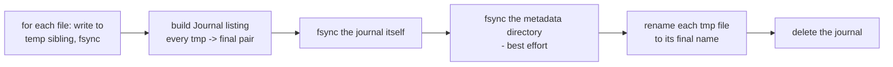

# Transaction Model

How gh-helix guarantees `.metadata/*.json` is never left half-updated, even if the process is
killed mid-write — and how the same stage/verify/commit pattern is reused for directory moves.

## The problem

A `backup` run updates three files together: `repositories.json` (the discovery cache),
`manifest.json`, and `last-run.json`. If these were written independently and the process died
between the first and second write, `.metadata/` would be left in an inconsistent state — for
example, a `manifest.json` that references a rename that `repositories.json` doesn't yet know
about. The next run would have to guess which files are "ahead" and which are stale.

## The mechanism: journaled multi-file writes

`writeMetadataTransaction(metadataDir, files)` writes any number of files as a single atomic
unit:

1. Every file's content is written to a temp sibling (`.<basename>.tmp-<txId>`) and individually
   fsynced (`fsyncWriteFile`: open, write, `handle.sync()`, close) — each temp file is durable on
   disk before anything else happens.
2. A `Journal` (`{ entries: [{tmp, final}], createdAt }`) listing every pending rename is built
   and **also fsynced** before any rename occurs — the journal is the thing that makes recovery
   possible; it has to survive a crash just as reliably as the data it describes.
3. A best-effort fsync of the metadata directory itself follows, to durably persist the new
   directory entries. This step's failures are silently swallowed — directory fsync isn't
   reliably supported on every platform (notably Windows) — it's a durability *improvement*
   layered on top of, not a substitute for, the journal-based recovery in step 5 below.
4. Each temp file is renamed to its final name — a single atomic operation within a directory on
   both POSIX and Windows.
5. The journal file is deleted, marking the transaction complete.

## Recovery

`recoverPendingTransactions(metadataDir)` is called at the start of **every** metadata read or
write path (`loadCache`, `loadManifest`, `loadLastRun`, and the canonical branch of
`writeManifest`) — cheap and safe to call unconditionally, every time:

1. List the metadata directory for any `.tx-*.json` journal files left behind by a process that
   died between step 2 and step 5 above.
2. For each one found: parse it and replay the renames (`applyJournal`) — if a given temp file is
   already gone (because the rename for it had already completed before the crash), that entry is
   treated as already-applied, not an error.
3. If the journal file itself is corrupt/unreadable, it's force-removed — there's nothing safe to
   replay from a journal that can't be parsed, and leaving it in place would just mean every
   future command re-attempts the same failed recovery forever.
4. The journal file is removed once fully applied.

Because this runs before any read, a process that crashed mid-transaction leaves the *next*
invocation — of any command, not just `backup` — to transparently finish the interrupted write
before doing anything else. There's no separate `gh-helix repair` command, because none is
needed.

## What gets bundled together

`writeManifest`'s canonical branch (i.e., not a `--dry-run`) bundles `manifest.json` +
`last-run.json` + any `extraTransactionFiles` into one `writeMetadataTransaction` call.
`backup.ts` passes the repository cache write as an extra transaction file — but **only** when
discovery was live (not degraded) and this isn't a dry run — so `repositories.json`,
`manifest.json`, and `last-run.json` always advance together after a real `backup` run. See
[Repository Discovery: why backup doesn't persist the cache itself](repository-discovery.md#why-backup-doesnt-persist-the-cache-itself).

`--report <path>` is written **separately**, via a plain atomic write (temp + rename, no
journal), regardless of `canonical` — it's a convenience export, not part of the internal
consistency guarantee between the three canonical files.

## The same pattern, for directories

The journal above is specifically for **file** writes. Directory moves (orphan relocation,
repository renames) use an analogous but distinct stage/verify/commit algorithm — see
[`safeMoveDirectory`](architecture.md#failure-recovery) — because renaming a directory into place
needs a verification step (structural comparison, or `git fsck` for mirrors) that a plain file
write doesn't. Both share the same underlying principle: **never delete or overwrite the original
until the replacement is confirmed good and durably in its final location.**

| Operation | Staging | Verification | Commit | Recovery trigger |
| --- | --- | --- | --- | --- |
| Metadata files | `.tmp-<txId>` siblings + `.tx-<uuid>.json` journal | journal itself fsynced before any rename | rename each temp into place, delete journal | every metadata read/write call |
| Directory move (orphan/rename) | `<dest>.staging` | `git fsck` / structural compare on the staged copy | `rename(staging, destination)` | re-running the same command (`backup`, `clean`) |
| Restore | `<destination>.restoring` + `.verified` marker | LFS pointer-file scan | `rename(staging, destination)` | re-running `restore` |

## Why not just use a database?

A single-writer, journaled JSON-file model was chosen over embedding a database (SQLite,
LevelDB) — see [ADR-0003: Transactional metadata](adr/0003-transactional-metadata.md) for the
full reasoning, including why this keeps `.metadata/*.json` directly greppable, diffable, and
readable by external tooling without a database driver.

## See also

- [Metadata](metadata.md)
- [Locking](locking.md)
- [Architecture: Failure recovery](architecture.md#failure-recovery)
- [ADR-0003: Transactional metadata](adr/0003-transactional-metadata.md)
- [ADR-0005: Safe directory moves](adr/0005-safe-directory-moves.md)
